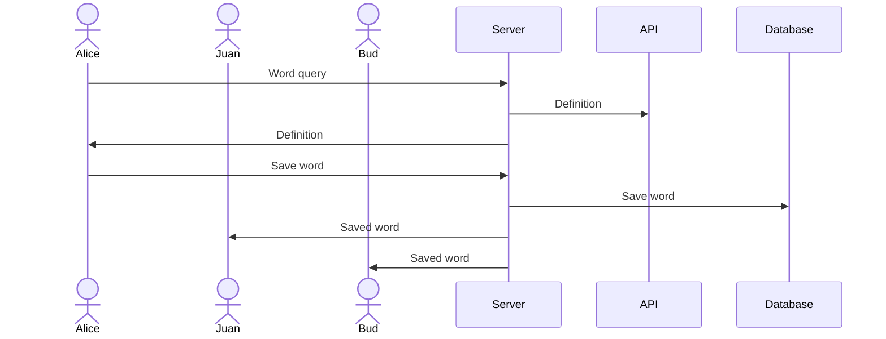

# Libre Books

[My Notes](notes.md)

Libre Books is an e-Book app where you can read books available in the public domain to learn a new language. It is interactive so you can learn new words and save them, and your friends can see your saved words too. 

> [!NOTE]
> This is a template for your startup application. You must modify this `README.md` file for each phase of your development. You only need to fill in the section for each deliverable when that deliverable is submitted in Canvas. Without completing the section for a deliverable, the TA will not know what to look for when grading your submission. Feel free to add additional information to each deliverable description, but make sure you at least have the list of rubric items and a description of what you did for each item.

> [!NOTE]
> If you are not familiar with Markdown then you should review the [documentation](https://docs.github.com/en/get-started/writing-on-github/getting-started-with-writing-and-formatting-on-github/basic-writing-and-formatting-syntax) before continuing.

### Elevator pitch

One of the best ways to learn a language is by reading. However, the apps I've seen for learning a language for reading have stories that aren't that interesting and if I get a book in a foreign language I have to look up words. That's why I will create an app with classic stories that you've always been meaning to read but never got around to it. Now you can, and you can learn a new language at the same time!

### Design

### Key features

- Secure login over HTTPS
- Ability to flip from one page to the next
- Ability to click a word to see it's translation
- User can choose to save a word they click on to new words
- New words are persistently stored
- User can see other users' saved words

### Technologies

I am going to use the required technologies in the following ways.

- **HTML** - Three main HTML pages. One for login, one for reading, and one for looking at saved words. I may add another for choosing a book or choose only one book. 
- **CSS** - The whitespace, font, and color of the reading page will make it look like a book. There will be one accent color for when a user clicks a word. I may incorporate an optional dark mode. 
- **React** - Once the user logs in, the screen will go to the reading page. Then the user can toggle between reading and looking at new words by clicking a button. The user changes pages by swiping. The screen is reactive to touching a word; it displays the definition of a word when the word is tapped. 
- **Service** - Backend service with endpoints for login, saving words, and retrieving other users' saved words. I will use a Project Gutenberg API to get books.
    * https://gutenbergapi.com/
- **DB/Login** - I will store login information, users, saved words, and the page a user is on. 
- **WebSocket** - As each user saves words, other users can see the words they saved. 

## 🚀 Specification Deliverable

> [!NOTE]
> Fill in this sections as the submission artifact for this deliverable. You can refer to this [example](https://github.com/webprogramming260/startup-example/blob/main/README.md) for inspiration.

For this deliverable I did the following. I checked the box `[x]` and added a description for things I completed.

- [x] I completed the prerequisites for this deliverable (Git commit requirement)
- [x] Proper use of Markdown
- [x] A concise and compelling elevator pitch
- [x] Description of key features
- [x] Description of how you will use each technology
- [x] One or more rough sketches of your application. Images must be embedded in this file using Markdown image references.

## 🚀 AWS deliverable

For this deliverable I did the following. I checked the box `[x]` and added a description for things I completed.

- [x] **Rented EC2 server** - I rented an EC2 server
- [x] **Leased domain name** - I leased libreboox.com
- [x] **Server accessible** from my domain: [https://libreboox.com](https://libreboox.com)

## 🚀 HTML deliverable

For this deliverable I did the following. I checked the box `[x]` and added a description for things I completed.

- [x] I completed the prerequisites for this deliverable (Simon deployed, GitHub link, Git commits)
- [x] **HTML pages** - I have pages for different languages, a book list, a page view, and saved words
- [x] **Proper HTML element usage** - I used many HTML elements, including head, body, footer, h1-h3, div, input, a, ul, table, and more
- [x] **Links** - All pages have links to Home, Languages, Continue Reading, and New Words. The Languages page links to a booklist, which links to an example page, which is at this point the same as Continue Reading. 
- [x] **Text** - The booklist, page, and new words pages have text.
- [x] **3rd party API placeholder** - Book page will come from project gutenberg API, contents of the word popup will come from a dictionary/translation API.
- [x] **Images** - page.html has an image as a placeholder, about page has images of different classic books
- [x] **Login placeholder** - Placeholder for username and password.
- [x] **DB data placeholder** - New words list for user and user's friends.
- [x] **WebSocket placeholder** - New words list for user's friends.

## 🚀 CSS deliverable

For this deliverable I did the following. I checked the box `[x]` and added a description for things I completed.

- [x] I completed the prerequisites for this deliverable (Simon deployed, GitHub link, Git commits)
- [x] **Visually appealing colors and layout. No overflowing elements.** - I used orange as a main color and have no overflowing elements.
- [x] **Use of a CSS framework** - I used bootstrap to format my buttons and my table of new words.
- [x] **All visual elements styled using CSS** - I styled all of my visual elements.
- [x] **Responsive to window resizing using flexbox and/or grid display** - I have boxes that reformat according to window size.
- [x] **Use of a imported font** - I imported archivo black and used it for all headers and buttons. 
- [x] **Use of different types of selectors including element, class, ID, and pseudo selectors** - I used many different type of selectors to edit specific parts of the html and not other parts. 

## 🚀 React part 1: Routing deliverable

For this deliverable I did the following. I checked the box `[x]` and added a description for things I completed.

- [x] I completed the prerequisites for this deliverable (Simon deployed, GitHub link, Git commits)
- [x] **Bundled using Vite** - I used Vite.
- [x] **Components** - I have components for each page of my app.
- [x] **Router** - I changed my links to use router instead.

## 🚀 React part 2: Reactivity deliverable

For this deliverable I did the following. I checked the box `[x]` and added a description for things I completed.

- [x] I completed the prerequisites for this deliverable (Simon deployed, GitHub link, Git commits)
- [x] **All functionality implemented or mocked out** - I used React extensively to make my buttons work and allow the user to customize the site.
- [x] **Hooks** - I used useEffect to save book progress and save time when the website changes between light mode and dark mode.

## 🚀 Service deliverable

For this deliverable I did the following. I checked the box `[x]` and added a description for things I completed.

- [ ] I completed the prerequisites for this deliverable (Simon deployed, GitHub link, Git commits)
- [ ] **Node.js/Express HTTP service** - I did not complete this part of the deliverable.
- [ ] **Static middleware for frontend** - I did not complete this part of the deliverable.
- [ ] **Calls to third party endpoints** - I did not complete this part of the deliverable.
- [ ] **Backend service endpoints** - I did not complete this part of the deliverable.
- [ ] **Frontend calls service endpoints** - I did not complete this part of the deliverable.
- [ ] **Supports registration, login, logout, and restricted endpoint** - I did not complete this part of the deliverable.
- [ ] **Uses BCrypt to hash passwords** - I did not complete this part of the deliverable.

## 🚀 DB deliverable

For this deliverable I did the following. I checked the box `[x]` and added a description for things I completed.

- [ ] I completed the prerequisites for this deliverable (Simon deployed, GitHub link, Git commits)
- [ ] **Stores data in MongoDB** - I did not complete this part of the deliverable.
- [ ] **Stores credentials in MongoDB** - I did not complete this part of the deliverable.

## 🚀 WebSocket deliverable

For this deliverable I did the following. I checked the box `[x]` and added a description for things I completed.

- [ ] I completed the prerequisites for this deliverable (Simon deployed, GitHub link, Git commits)
- [ ] **Backend listens for WebSocket connection** - I did not complete this part of the deliverable.
- [ ] **Frontend makes WebSocket connection** - I did not complete this part of the deliverable.
- [ ] **Data sent over WebSocket connection** - I did not complete this part of the deliverable.
- [ ] **WebSocket data displayed** - I did not complete this part of the deliverable.
- [ ] **Application is fully functional** - I did not complete this part of the deliverable.
